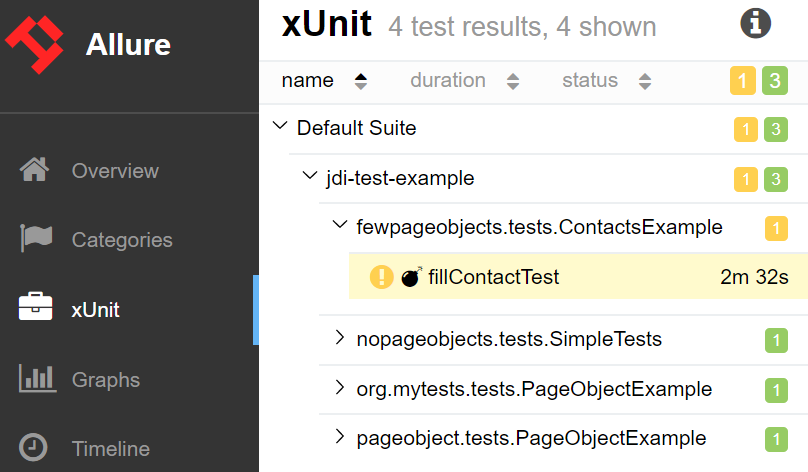
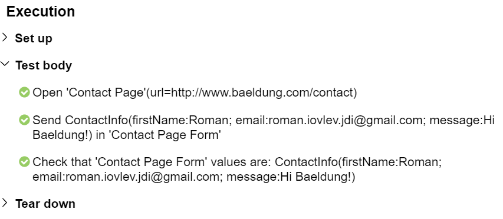
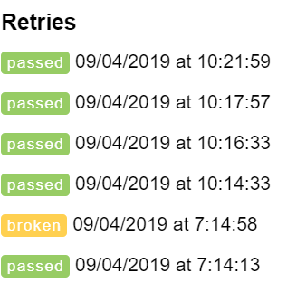

# Tutorial
## Integration
This article is a quick, practical introduction to working with [JDI Light](https://github.com/jdi-testing/jdi-light).<br/>
In this section, we’ll start with a simple scenario – opening a browser window, navigating to a given URL and looking for some desired content on the page.<br/>
```java 
<dependency>
    <groupId>com.epam.jdi</groupId>
    <artifactId>jdi-light-html</artifactId>
    <version>RELEASE</version>
</dependency>
```

### Maven Dependencies

In the pom.xml file, add the following dependency: <br/>
The latest version can be found in the [Maven Central Repository](https://search.maven.org/classic/#search%7Cga%7C1%7Cjdi-light).<br/>
<br/><br/>
### Configuration

```java
driver=chrome
#drivers.version=2.23 | LATEST– by default latest
#timeout.wait.element=10 – timeout in seconds to wait element on opened page
#timeout.wait.page=60 – timeout in seconds to open a new page
domain=https://epam.github.io/JDI/ – web application (used if you work with one application in tests)
#page.check.after.open=NONE – no auto-validation | NEW_PAGE – will validate page url and titile utomatically while new page opens | EVERY_PAGE – validate page on each action
#page.load.strategy=normal – how to wait page load
#element.search.strategy=strict | soft | visible, multiple | any, single – how to find element
#browser.size=MAXIMIZE | 1024x762
```
To run tests in JDI you don’t need to setup anything. By default JDI will download Chrome driver automatically, setup it and run while you try to access some page.<br/>
But if you would like to change default settings you can do this in test.properties file (src/test/resources). Here some typical settings.<br/>
<br/><br/><br/><br/>
## Simple Test Example
```java
public class JDILightExample { 
    public openPage() {
        WebPage.openUrl("http://www.baeldung.com/")
    }
}
```
Simple test to open http://www.baeldung.com/ site will look like this: <br/>
You also can do all typical actions with browser using WebPage static methods like: **getUrl(), getTitle(), back(), forward(), getHtml(), refresh()**<br/>
And not so typical like **scroll up/down/left/right/top/bottom** and **zoom** the page.<br/>

```java
@JSite("http://www.baeldung.com/")
public class SiteJdi {
    @Url("/") @Title("Baeldung | Java, Spring and Web Development tutorials")
    public static HomePage homePage;
}
public class PageObjectExample implements TestsInit { 
    public void openPage() {
        homePage.open();
        homePage.checkOpened();
        //...
    }
    public void onHomePage() {
        homePage.shouldBeOpened();
        //...
    }
}
```
But if you would like to operate with pages we recommend to create PageObject for it:<br/>
Pretty simple and obvious isn’t it? Now we can open home page in one line after that we can validate that correct page opened (will throw exception if action failed).<br/>
<br/>
Additional option is to use method shouldBeOpened() that validate if page is already opened and if not will open it. This smart action can save your tests time.<br/>
<br/><br/><br/><br/><br/><br/><br/>

```java
public interface TestsInit {
    static void setUp() {
        PageFactory.initElements(SiteJdi.class);
    }
}
```
_*I hope you awareness enough and interested about TestInit class. This is just simple one method interface that initialize all PageObjects (HomePage in our case) in one line._<br/>
_Yes with JDI Light you can do it in one line for all your Page Objects!_<br/>

## Fill Contact Form Example
### Scenario
Now let’s look on more complex case:
1. Open Baeldung
2. Go to Contact page
3. Fill Contact Form
4. And validate that data in form is correct
_* Thanks to captcha we will not sent the form in this case but in your test application you can switch off captcha and validate filled form on next page for example or in DB_<br/>
### Create PageObjects
First we need to create 2 Page Objects: HomePage – from previous example and ContactPage with fields and button on it

```java
@Url("/") @Title(value = "Baeldung | Java", validate = CONTAINS)
public class HomePage extends WebPage { }

@Url("/contact") @Title("Contact Me | Baeldung")
public class ContactPage extends WebPage {
    @FindBy(css = "[name=first_name]") TextField firstName;
    @FindBy(css = "[name=email]") TextField email;
    @FindBy(css = "[name=message]") TextArea message;
    @FindBy(xpath = "//*[text()='Send Your Message']") Button send;
}
```
But standard @Findby can be simplified in JDI annotations @Css and @XPath or even with universal @UI:

```java
public class ContactPage extends WebPage {
    @Css("[name=first_name]") TextField firstName;
    @Css("[name=email]") TextField email;
    @Css("[name=message]") TextArea message;
    @XPath("//*[text()='Send Your Message']") Button send;
}
public class ContactPage extends WebPage {
    @UI("[name=first_name]") TextField firstName;
    @UI("[name=email]") TextField email;
    @UI("[name=message]") TextArea message;
    @ByText("Send Your Message") Button send;
}
```
In this case our Site entity will look like this:

```java
@JSite("http://www.baeldung.com/")
public class BaeldungSite {
    public static HomePage homePage;
    public static ContactPage contactPage;
}
```
### Create Test Data
We need to fill the form with some Contact information, let’s create an entity for it

```java
public class ContactInfo extends DataClass<ContactInfo> {
    public String firstName, email, message;
}
```
And fill it with some data:

```java
ContactInfo MY_CONTACT = new ContactInfo().set(c -> {
        c.firstName = "Roman";
        c.email = "roman.iovlev.jdi@gmail.com";
        c.message = "Hi Baeldung!";} 
);
```
_* You can put you entities in separate DataProvider file or just near the test if this is one time entity.

### Init Page Objects and Open BaeldungSite site
Init all this pages and open home page of Baeldung site:_

```java
public interface TestsInit {
    static void setUp() {
        logger.setLogLevel(STEP);
        initElements(BaeldungSite.class);
        homepage.open()
    }
}
```
_* For demo purposes we also set log level to STEP in order to have business actions level log. For more details you can change log level to INFO (by default) or DEBUG._<br/>
### Write test scenario
And now we can write a test:

```java
public class ContactsExample implements TestsInit {
    @Test
    public void fillContactTest() {
        contactPage.open();
        contactPage.asForm().send(MY_CONTACT);
        contactPage.asForm().check(MY_CONTACT);
    }
}
```
## Test run results
### Test scenario and log
This simple 3 rows test will:
- Open Baeldung site
- Navigate to Contact Page
- Fill contact form with your data and 
- Validate that form filled correctly. 
Exactly what see in test scenario. As result you will see detailed user actions log:

```
[ STEP 21:52.780]: Open 'Home Page'(url=http://www.baeldung.com/)
[ STEP 21:59.008]: Open 'Contact Page'(url=http://www.baeldung.com/contact)
[ STEP 22:00.236]: Send ContactInfo(firstName:Roman; email:roman.iovlev.jdi@gmail.com; message:Hi Baeldung!) in 'Contact Page Form'
[ STEP 22:01.633]: Check that 'Contact Page Form' values are: ContactInfo(firstName:Roman; email:roman.iovlev.jdi@gmail.com; message:Hi Baeldung!)
```
Pretty much the same as test scenario do. You can share this log with BA or Client to demonstrate what your tests do.<br/>
If you need more details for maintenance purposes, you can change the level of your log to INFO. Using log4J settings you can customize output streams and log formats.
### Page Object actions with elements. Handle flaky tests
You don’t need to implement open, send and check methods they are already developed for you (as well as a lot of other typical functions).<br/>
In addition, you don’t need to think about Thread sleeps, Explicit waits, stale or no such element exceptions. JDI Light will handle all staff that can make tests flaky for you. You just need to think about business part of test scenarios.
### Failed exceptions and Allure reports
You can stop before method check execution, change some filled (e.g. firstName to “Roman (changed)”) and continue test to see that check will throw exception in case of some mismatch. And this assertion will be pretty much readable also:

```
Failed to execute 'check' for element 'Contact Page Form' action during '10' seconds. 
Exception: Check form failed:
Field 'firstName' (Actual: 'Roman (changed)' <> Expected: 'Roman')
```
JDI has good integration with Allure so as result of this test (if Allure are in place) you can see colorful and readable report with all tests execution results:


- **Test execution log**


- **Detailed test’s fail reasons information (you can click on … under error text and observe full exception stack trace)**


- **And history of all previous tests executions**


 
To generate such Allure report you need to copy allure-results folder from project root to target folder and run allure-serve maven plugin

## Create Custom controls
TBD

## JDI settings at glance
TBD

## Test Framework structure
TBD
